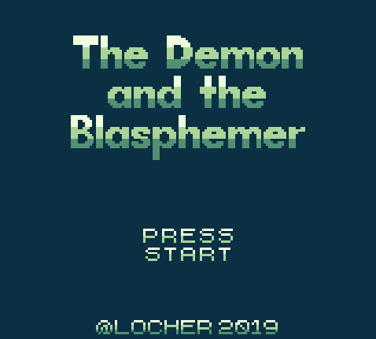
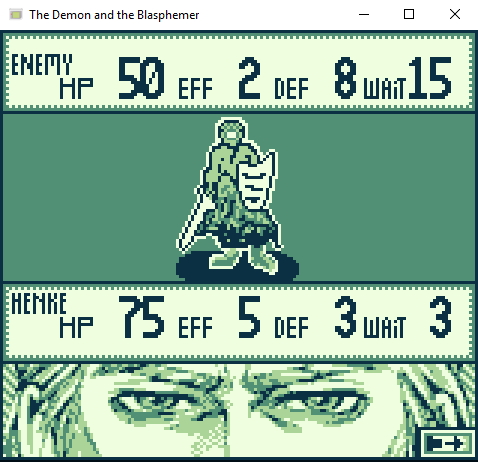

# The Demon and the Blasphemer

A personal project, driven by the desire to create a unique gameboy experience and to tackle its limitations head on. 
This project is created with the dev build version 1.2 of [GB Studio](https://www.gbstudio.dev/). 
Additional software being used are: 
- [Paint.net](https://www.getpaint.net/) for all graphical assets
- [fmmidi](http://unhaut.x10host.com/fmmidi/) in order to understand the inner workings of .midi files.
- [OpenMPT](https://openmpt.org/) for the transcription of .midi files into .mod files for the gbt player.

I am also happy to give my thanks to the very helpful [Discord Community Server](https://discord.gg/bxerKnc) of GB Studio.

# The Battle System

A honorable recreation of the battle system found in [Helen's Mysterious Castle](https://store.steampowered.com/app/418190/Helens_Mysterious_Castle/). This battle system relies solely on the attributes of the weapons while the player can only call the HP value his own. This battle is fought using the following attributes:

| Attribute Name     | Description                       |
| ------------------ | --------------------------------- |
| HP (Health Points) | Battle is won or lost due to this value |
| EFF (Effect)       | Effectivity of the Action (Attack / Heal)    |
| DEF (Defense)      | Subtracts the Enemy Action's Effect value |
| WAIT               | Delay of the chosen Action until execution|

Due to limitations of GBStudio, it will only be possible to equip a primary weapon and a spell.

# The Demonic Chant System

Demonic beings are unable to utilize human chants in order to work magic. Instead, they are able of pronounce single syllable spells by using the demonic alphabet. These syllables are infused with magic and cannot be spoken by human beings. The system requires the construction of a demonic chant by forming a single syllable out of up to three demonic letters. The letters belong to one of three types that are listed below:

| Syllable Type     | Description                       |
| ------------------ | --------------------------------- |
| Prefix  | Determines the spell's invocation process and can influence the spell's attributes |
| Arsis      | Determines the primary spell pattern and its basic attributes    |
| Suffix      | Determines the spell's lasting effect on the battle and can influence the effected |

The player is urged to find ways to populate the initial small repertoire of demonic letters.

# The Interactive Map System

The map system is a highly potent system that relies on the player uncovering the playable environment and slowly filling the blanks of the initially black map. The map screen can be traversed as to gain valuable information on specific map screens.
